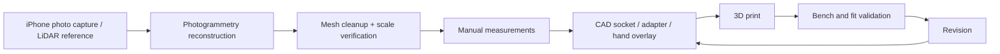

# 3D Scan and Jarvis Integration

## Immediate workflow

The prosthetic project does not wait for Jarvis. Use existing scan/CAD tools now, then integrate the same workflow into Jarvis later.



## Capture rules

For photogrammetry:

- residual limb stays completely still
- camera moves around it
- high overlap between images
- multiple height rings
- diffuse, consistent lighting
- known dimension / scale reference
- keep original photos

Do not combine image sets where the limb moved into one reconstruction job.

## Engineering data products

Store privately:

- raw images
- master high-resolution mesh
- cleaned/scaled mesh
- intact-side reference scan
- anonymous measurement sheet
- fit notes
- patient-specific electrode/sensor map

Store in public GitHub only:

- generic scripts
- anonymous sample geometry, if explicitly safe to publish
- CAD templates with no patient-derived identifying geometry

## Jarvis future workspace

Jarvis can later provide a 3D engineering workspace without running heavy photogrammetry on the Oracle VM.

Recommended architecture:

```text
Jarvis Flutter UI
      |
      v
3D viewer (GLB preview)
      |
      v
Owner API / governed engineering capability
      |
      v
Geometry worker
  - Trimesh
  - Open3D
  - CadQuery / OpenCascade
      |
      v
Private geometry + test-data storage
```

### Division of work

The iPhone or dedicated photogrammetry engine performs image reconstruction.

The Jarvis server performs lighter deterministic tasks such as:

- mesh validation
- scale checks
- alignment
- cross-sections
- dimensions
- volume
- intact-side / residual-side comparison
- CAD parameter generation
- prosthesis-length envelope checks
- revision tracking
- test-data visualization and comparison

The browser/device GPU renders the interactive 3D view.

## Safety boundary — non-negotiable for V1

Jarvis is an **engineering-analysis and documentation tool**, not the prosthesis controller.

For the wearable V1:

- Jarvis must not command motors directly
- Jarvis must not set or bypass current/travel/thermal safety limits
- Jarvis must not be required for opening, closing or emergency release
- loss of network/cloud/Jarvis must have no effect on basic safe operation
- embedded firmware and mechanical/electrical safety remain authoritative

Future research may explore high-level assistance only after the core prosthesis is reliable, and only through an independent safety boundary.

## Digital twin direction

A future anonymous case workspace can link:

- residual-limb scan
- intact-hand reference
- socket revision
- prosthetic hand revision
- EMG/FMG electrode or sensor map
- test results
- cycle-life results
- fit observations
- mass/build-height budget

This is an engineering aid, not a clinical decision system and not a live safety controller.