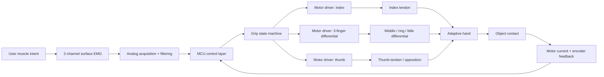
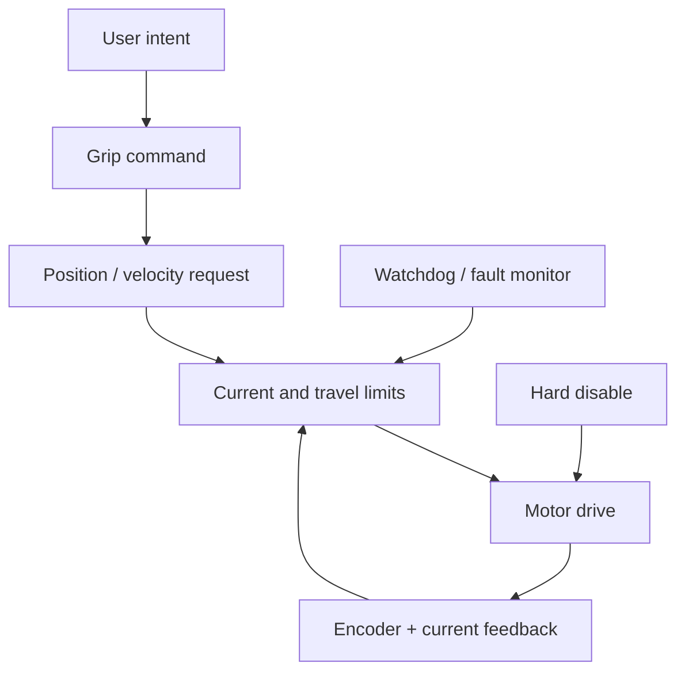

# System Architecture

## Functional chain

## V1 design priorities

1. safe predictable behavior
2. comfortable length and fit
3. reliable useful grasps
4. low mass
5. low component count
6. local repairability
7. environmental hardening
8. advanced autonomy / ML later

## Actuation layout

### Actuator A - index

Independent index flexion improves pinch and tripod placement.

### Actuator B - middle/ring/little

One actuator drives an adaptive differential so the three fingers can conform around non-uniform objects.

### Actuator C - thumb

The thumb receives its own actuator because thumb position dominates practical grasp quality. The exact thumb mechanism is a major design decision and will be bench-tested before freezing the palm.

## Mechanical philosophy

- tendon-driven flexion
- passive spring/elastic extension
- mechanical compliance before software complexity
- modular fingers
- replaceable tendons
- metal pins/shafts where repeated bearing wear is expected
- service access from the dorsal side of the palm

## Control philosophy

The controller is layered so safety does not depend on EMG classification.

## Packaging rule for this user case

Because the residual forearm is long, the wrist/adapter volume must be kept extremely short. Most actuation volume should live inside the prosthetic palm, not in a long distal extension after the residual limb.

## Modular boundaries

- socket / suspension module
- wrist / mechanical adapter
- hand module
- electronics module
- battery module
- EMG electrode module

A failure in one module should not require remaking the whole prosthesis.