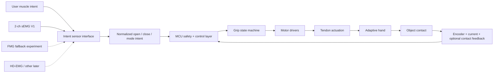
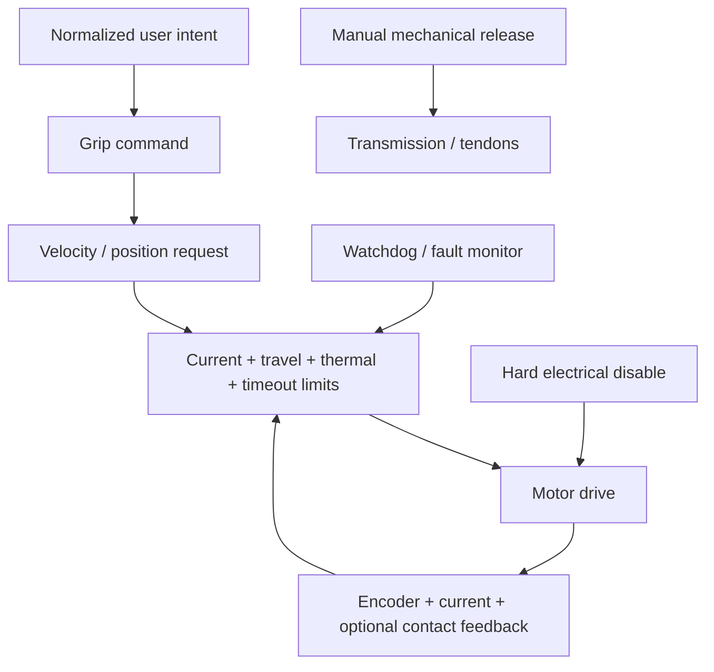

# System Architecture

## Functional chain

The safety/control stack is intentionally independent from the exact human-intent sensor.

## V1 design priorities

1. comfort, skin safety and correct build length
2. safe predictable release and grasp
3. reliable useful daily tasks
4. low distal mass
5. low component count
6. local repairability
7. sweat/environmental tolerance
8. advanced dexterity, feedback and autonomy later

## Actuation layout: baseline, not frozen

### Baseline A - three actuators

- **Actuator A:** independent index flexion
- **Actuator B:** middle/ring/little adaptive differential
- **Actuator C:** thumb flexion/opposition

This layout aims to preserve thumb-index precision while allowing the remaining fingers to wrap adaptively.

### Comparison B - two actuators

Before the palm is frozen, compare the baseline against a two-actuator architecture:

- four-finger adaptive synergy/differential
- independent thumb (or mechanically pre-positioned thumb during the architecture experiment)

The third actuator stays only if its measured pinch/tripod benefit justifies its mass, volume, current and complexity.

## Mechanical philosophy

- tendon-driven flexion
- passive spring/elastic extension where beneficial
- mechanical compliance before software complexity
- modular fingers and replaceable tendons
- metal pins/shafts where repeated bearing wear is expected
- overload/breakaway or compliant protection at vulnerable joints
- service access from the dorsal side of the palm
- optional series elasticity tested experimentally rather than assumed
- no normal grasp should require sustained near-stall motor current

If a self-locking transmission, brake or latch is used to save holding energy, the hand must include a **manual mechanical emergency release**.

## Control philosophy

The controller is layered so safety does not depend on EMG quality, machine learning, phone connectivity or Jarvis.

For initial myoelectric operation, contraction amplitude primarily commands open/close **velocity/rate**. Mechanical travel and current limits determine endpoints and safe force.

## Sensor abstraction

The intent-sensing front end and the motor-safety controller are separate modules.

V1 order:

1. two-channel surface EMG
2. low-cost force-myography experiment if EMG stability is inadequate
3. additional/HD-EMG, sonomyography or other research interfaces later

Changing the human-intent sensor must not require redesigning the hand safety logic.

## Packaging rule for this user case

Because the residual forearm is long, the wrist/adapter volume must be extremely short.

- distal adapter target: <=25 mm
- stretch target: <=15 mm if anatomy/mechanics allow
- final length checked against the intact limb
- preserve physiological pronation/supination where usable
- no powered wrist rotation in V1 unless a measured user task requires it
- place actuation volume inside the palm rather than creating a long distal motor cluster

## Wet/dry zoning

Sweat protection begins in architecture, not after the hand works.

Separate where practical:

- skin-facing / sweat-exposed zone
- electrode interface
- protected electronics zone
- battery zone
- service openings

Plan gasket grooves, cable exits/strain relief, drainage/ventilation and corrosion-resistant fasteners before CAD freeze. Formal water-ingress claims require later testing.

## Modular boundaries

- socket / suspension module
- low-profile wrist / mechanical adapter
- hand module
- intent-sensor / electrode module
- embedded controller / drivers
- battery module

A failure in one module should not require remaking the whole prosthesis.

## AI / Jarvis boundary

Jarvis may later analyze scans, CAD revisions and test data. It has **no real-time actuator authority** in V1 and cannot bypass the embedded limits, watchdog, hard disable or manual release.