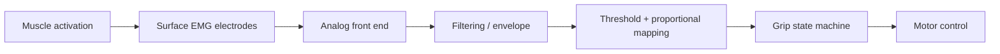

# EMG and Control Design

## V1 principle

A usable V1 must not depend on advanced machine learning. Start with a control method that is easy to understand, calibrate and troubleshoot.

## Initial EMG interface

Use two surface EMG channels over a clinically appropriate agonist/antagonist muscle pair in the residual forearm.

Initial behavior:

- flexor-dominant activation -> close / increase commanded grip
- extensor-dominant activation -> open
- physical grip-mode selector -> power / pinch / tripod / hook

The exact electrode sites must be chosen on the real user, not copied blindly from a diagram.

## Signal path



## Why a physical grip selector first

A dedicated selector makes mode changes deterministic and reduces the mental burden of special co-contraction gestures. It also lets the engineering team debug grasp mechanics independently from pattern recognition.

## Motor feedback

Each actuator should provide:

- position/encoder feedback where practical
- motor-current measurement

Motor current is used for:

- contact/stall detection
- grip force limiting
- fault detection

It is not a substitute for full tactile sensing, but it is highly valuable in V1.

## State machine

Suggested high-level states:

```text
OPEN
  -> CLOSING
  -> CONTACT / HOLD
  -> OPENING
  -> OPEN

Any state -> FAULT -> motor drive disabled or safely relaxed
```

## Safety behaviors

- maximum current per actuator
- maximum travel
- timeout for commanded motion
- brownout handling
- watchdog reset
- sensor-disconnect detection where feasible
- immediate physical disable

## Future control research

After V1 direct control is stable, evaluate:

- additional EMG channels
- LibEMG feature extraction and classifiers
- pattern recognition for grip selection
- adaptive calibration
- vibrotactile feedback

Machine learning is an enhancement, not a prerequisite for safe basic use.