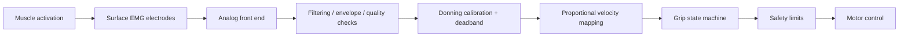

# Intent Sensing and Control Design

## V1 principle

A usable V1 must not depend on advanced machine learning. Start with a control method that is easy to understand, calibrate, troubleshoot and release safely.

The hand-control firmware must also avoid being permanently tied to one sensing technology.

## Primary V1 interface: two-channel surface EMG

Use two surface-EMG channels over a clinically appropriate agonist/antagonist muscle pair on the residual forearm.

Initial behavior:

- flexor-dominant activation -> proportional **closing velocity/rate**
- extensor-dominant activation -> proportional **opening velocity/rate**
- physical grip-mode selector -> power / pinch / tripod / hook

The exact sites must be chosen on the real user and re-checked after the socket/interface changes. Do not copy electrode positions blindly from anatomy diagrams.

## Why velocity/rate control first

Recent 2026 co-adaptive myocontrol research comparing 3-DOF velocity and position control found lower errors, better success/path efficiency and lower workload overall with velocity control, while position control enabled somewhat more simultaneous actuation.

Our direct-control V1 does not need 3-DOF machine learning, but the design lesson is useful: map muscle amplitude primarily to **how fast the hand moves**, not to an assumed absolute finger position.

Endpoint and force behavior remain governed by travel/current/contact limits.

## Signal path



## Don/doff calibration

Electrode contact and skin conditions change between fittings. V1 should expect a short calibration step after donning rather than pretending one fixed threshold will work forever.

Record:

- baseline/rest level
- comfortable activation range per channel
- channel separation / co-contraction behavior
- signal quality/noise indicator
- calibration time

The calibration must not be so burdensome that the user avoids wearing the device.

## Robustness tests

Test direct control under realistic variation:

- repeated don/doff
- forearm orientation / arm position
- repeated contractions / fatigue
- sweat and warm skin
- walking/body motion where safe
- electrode pressure changes
- nearby motor/electrical noise

Log false activations, missed commands and time-to-release.

## Physical grip selector

A dedicated selector makes mode changes deterministic and reduces the mental burden of special co-contraction gestures. It also lets mechanics and EMG be debugged independently.

Grip-mode ML is a later improvement, not required for first usability.

## Sensor abstraction

The firmware should accept a normalized intent interface instead of directly embedding all logic into the MyoWare/sEMG driver.

Conceptually:

```text
sEMG front end ---------\
FMG front end (future) ---+--> normalized intent --> grip controller --> safety --> motors
HD-EMG / SMG (later) ----/
```

### Plan B: force myography

A 2026 review of upper-limb prosthetic interfaces identifies force myography (FMG), sonomyography, mechanomyography and myokinetic sensing as alternative muscle-deformation approaches that have progressed to clinical testing in transradial users.

If conventional sEMG is unreliable for this user despite good electrode/socket work, a low-cost pressure/force array around the forearm is a reasonable **parallel experiment** before jumping to expensive HD-EMG or ultrasound.

This is not an instruction to replace EMG now. It prevents an avoidable architecture dead end.

## Why not HD-EMG in V1

HD-EMG (>16 channels in common research definitions) can exploit spatial muscle patterns and is a serious research direction. Current reviews also identify practical barriers for embedded prostheses:

- many electrodes and more cabling/electronics
- electrode shift across don/doff
- fatigue/posture/noise sensitivity
- dry-contact mechanical integration
- more ADC and compute requirements
- need for robust real-time algorithms

Therefore V1 stays low-density and serviceable. Design the socket/electronics so future sensing research remains possible.

## Motor feedback

Each actuator should provide where practical:

- encoder/position feedback
- motor-current measurement

Motor current is used for:

- contact/stall inference
- grip-force limiting
- fault detection

It is not a substitute for tactile sensing. Thumb/index geometry should reserve space for optional pressure/contact sensing if later testing shows a need.

## State machine

Suggested high-level states:

```text
OPEN
  -> CLOSING
  -> CONTACT / HOLD
  -> OPENING
  -> OPEN

Any state -> FAULT -> active drive disabled / safely relaxed
```

If the transmission is mechanically self-locking, FAULT handling must be paired with a hardware/manual release path; simply cutting power may not release the object.

## Safety behaviors

- maximum current per actuator
- maximum travel
- timeout for commanded motion
- thermal limits where relevant
- brownout handling
- watchdog reset
- sensor-disconnect detection where feasible
- immediate physical electrical disable
- manual mechanical release when required
- no dependency on phone/cloud/Jarvis for safe basic operation

## Future control research

After direct V1 control is stable, evaluate selectively:

- FMG comparison / sensor fusion
- additional or HD-EMG channels
- LibEMG feature extraction/classifiers
- incremental/adaptive calibration
- pattern recognition for grip selection
- vibrotactile or hybrid feedback
- shared autonomy/vision only after core daily use is proven

Machine learning is an enhancement, not a prerequisite for safe basic use.

## Key recent evidence

- Co-adaptive velocity vs position myocontrol (2026): https://doi.org/10.1109/TNSRE.2026.3657400
- HD-EMG interfaces review (2025): https://doi.org/10.3389/fnins.2025.1655257
- Muscle-deformation interfaces review (2026): https://doi.org/10.1109/TNSRE.2026.3710283
