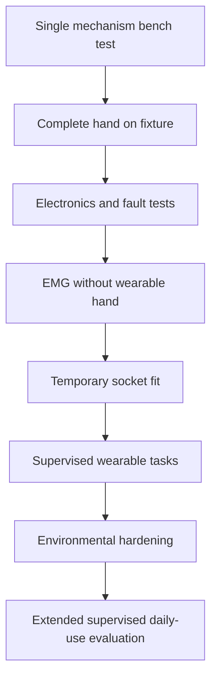

# Validation and Safety Plan

## Principle

Human use begins only after the relevant subsystem has passed the previous bench gate. The project should be managed with the logic of ISO 14971 risk management even though the student prototype is not a certified medical device.

## Main hazards

| Hazard | Typical cause | Primary control |
|---|---|---|
| Excessive grip force | software error, stall, wrong threshold | current limit + travel limit + hard disable |
| Finger/pinch injury | exposed moving joints | guards, compliant geometry, safe gaps |
| Skin injury | poor socket pressure distribution | staged fitting + relief + inspection |
| Electrical fault | damaged wiring/battery | protected pack, fuse, insulation, strain relief |
| Thermal discomfort | motor/driver/battery heating | temperature monitoring and thermal limits |
| Unexpected motion | EMG noise or software fault | intent thresholds, state machine, watchdog |
| Detachment/drop | weak suspension or adapter | structural test and retention checks |
| Tendon failure | abrasion/fatigue | replaceable routing, inspection, cycle test |
| Water/sweat ingress | unsealed electronics | enclosure, coating, seals, defined use limits |

## Validation ladder

## Mechanical tests

- tendon-force vs fingertip/grip force
- repeated full-range cycling
- blocked-finger / adaptive differential behavior
- finger overload and impact behavior
- screw loosening
- tendon/pulley wear
- structural adapter retention

## Electrical/control tests

- motor stall
- encoder loss
- EMG disconnect/noise
- MCU reset while gripping
- brownout
- battery low-voltage condition
- stuck command
- driver overheating

## Human-factor tests

- don/doff repeatability
- comfort and skin checks
- EMG repeatability after refitting
- command success/error rate
- object drop rate
- ability to release an object quickly
- representative daily activities

## Standards to track

- ISO 14971:2019 - medical-device risk management
- ISO 22523:2006 - external limb prostheses/orthoses requirements and tests; revision is in final-draft development
- ISO/AWI 26209 - test methods for externally powered prosthetic hands, under development

These references guide engineering discipline; they do not make the project certified.