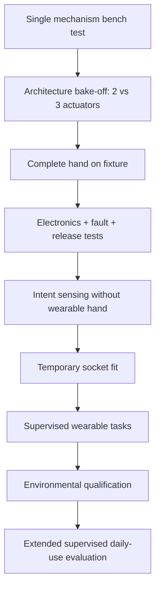

# Validation and Safety Plan

## Principle

Human use begins only after the relevant subsystem has passed the previous bench gate. Manage the project with the logic of ISO 14971 risk management even though the student prototype is not a certified medical device.

Bench success does not equal wearable safety, and wearable success in one short session does not equal daily-use readiness.

## Main hazards

| Hazard | Typical cause | Primary control |
|---|---|---|
| Excessive grip force | software error, stall, wrong threshold | current limit + travel limit + mechanical compliance + hard disable |
| Hand cannot release object | self-locking gearbox/brake/latch, dead battery | manual mechanical emergency release + fault tests |
| Finger/pinch injury | exposed moving joints | guards, compliant geometry, safe gaps |
| Impact/gear damage | accidental knock or overloaded digit | breakaway/compliant finger strategy + overload testing |
| Skin injury | poor socket pressure distribution | staged fitting + relief + inspection |
| Sweat-related signal/fit failure | heat, moisture, electrode movement | ventilation, repeatable retention, wet/dry zoning, re-calibration |
| Electrical fault | damaged wiring/battery | protected pack, fuse, insulation, strain relief |
| Thermal discomfort | motor/driver/battery heating | temperature monitoring/testing and limits |
| Unexpected motion | EMG noise, false activation or software fault | deadband, intent thresholds, state machine, watchdog |
| Detachment/drop | weak suspension or adapter | structural test and retention checks |
| Tendon failure | abrasion/fatigue | replaceable routing, inspection, cycle test |
| Water/sweat ingress | poor sealing | architecture-level zoning/seals, coating, defined use limits |

## Validation ladder

## Mechanical durability gates

Project development gates:

- **10,000 cycles minimum** on the selected mechanism before wearable integration
- **100,000 full-hand cycles** before extended supervised daily-use evaluation
- **250,000 cycles** as a longer development target

At intervals inspect:

- tendon abrasion/elongation
- pulley/spool wear
- pin/joint wear
- gearbox backlash/noise
- cracks or creep in printed parts
- screw loosening
- change in grip force and closing time

These are project gates, not lifetime claims.

## Mechanical performance targets

Initial engineering targets:

- power/cylindrical grip >=30 N; >=50 N stretch
- pinch >=10–15 N; >=20 N stretch
- full open-to-close <=1.0 s
- repeatable blocked-finger/adaptive-differential behavior
- no tendon derailment under representative grasps
- controlled overload behavior
- manual release works after total electrical power loss if transmission can lock

ISO/AWI 26209 is now under development specifically for force and repetitive-grasp durability of externally powered prosthetic hands and covers cylindrical grasp, pinch and lateral pinch. Follow its development and align test fixtures where practical.

## Architecture bake-off test

Before final palm CAD, compare the two- and three-actuator concepts using the same object/task set.

Record:

- hand/palm mass
- actuator mass and occupied volume
- power-grip force
- pinch and tripod success/repeatability
- opening width
- closing time
- energy per grasp and hold power
- failure modes / tendon complexity
- service time

Keep the third actuator only if functional benefit is measured, not assumed.

## Electrical/control fault tests

Test deliberately:

- motor stall
- encoder loss / invalid feedback
- EMG disconnect
- EMG noise / false activation
- MCU reset while gripping
- brownout
- battery low-voltage state
- stuck command
- driver overheating
- motor overheating
- sensor/front-end restart
- kill-switch operation
- complete power removal while holding an object
- manual mechanical release after power loss where required

A safety feature is not accepted until its failure case has been deliberately created and observed.

## Intent-interface robustness

For sEMG baseline, measure:

- rest noise and activation separation
- calibration time
- false activation rate
- missed-command rate
- release latency
- repeated don/doff variability
- arm-position effect
- fatigue effect
- warm/sweaty-skin effect

If the user cannot achieve robust direct control despite good socket/electrode work, run the planned FMG comparison before escalating to a complex HD-EMG/ML system.

## Human-factor / functional tests

Use a fixed repeatable task set rather than only demonstrations chosen because the hand can already do them.

### Daily-object battery

Include representative tasks such as:

- bottle/cup grasp and controlled release
- carry by handle/bag loop
- spoon/fork manipulation
- phone hold/positioning
- door/handle interaction
- pen or small-object pickup
- simple clothing interaction

Record time, drops, failed grasps, failed releases, mode changes and user comments.

### Standardized performance

Use the targeted Box and Block Test (tBBT) or standard BBT when appropriate. A 2025 study in 20 transradial unilateral prosthesis users reported good-to-excellent test-retest reliability and excellent interrater reliability for the tBBT.

Do not rely on a single score. Combine functional task data with:

- comfort and skin inspection
- don/doff repeatability
- suspension/rotation observations
- command-error metrics
- qualitative user priorities

## Socket/skin checks

During supervised fitting:

- inspect skin before and after
- document pressure/redness location and duration
- stop for concerning pain, skin injury or neurological symptoms
- check rotation/migration under load
- re-check signal quality after don/doff and after warming/sweat
- do not treat a 3D scan as evidence that a region is safe to load

## Environmental qualification

Environmental design features start early, but claims are earned by tests.

Test in a controlled progression:

- sweat/moisture exposure of skin-facing parts
- cleanup/drying
- corrosion checks
- dust exposure
- elevated ambient temperature / solar-heating proxy where appropriate
- splash/rain exposure
- seal inspection after repeated service opening

Do not claim an IP rating without the corresponding defined test.

## Standards to track

- **ISO 14971:2019** — medical-device risk management; confirmed current in 2025
- **ISO 10993-1:2025** — biological evaluation/safety of body-contacting medical-device materials within a risk-management process
- **ISO 22523:2006** — current published external limb prostheses/orthoses requirements and test methods
- **ISO/FDIS 22523, Edition 2** — in final approval in 2026 and intended to replace ISO 22523:2006
- **ISO/AWI 26209** — new 2026 work item for grasp force and repetitive durability of externally powered prosthetic hands

These references guide engineering discipline; they do not make the project certified.

## Go / no-go rule

No extended supervised wear until:

- selected architecture has passed the 100,000-cycle gate or the team has documented a justified, reviewed alternative gate
- fault release works
- battery/thermal behavior is characterized
- socket shows acceptable supervised skin/comfort behavior
- control remains usable after repeated don/doff
- risk register has no uncontrolled high-risk hazard known to the team

The project can remain a successful research platform even if a particular wearable revision fails a human-use gate. The correct response to failed evidence is redesign, not lowering the gate silently.

## Key evidence

- tBBT prosthesis-user validation: https://doi.org/10.1016/j.arrct.2025.100427
- ISO/AWI 26209: https://www.iso.org/standard/92838.html
- ISO 10993-1:2025: https://www.iso.org/standard/10993-1
